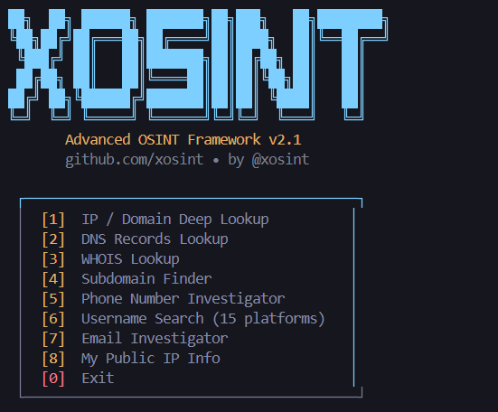

<div align="center">

```
 ██╗  ██╗ ██████╗ ███████╗██╗███╗   ██╗████████╗
 ╚██╗██╔╝██╔═══██╗██╔════╝██║████╗  ██║╚══██╔══╝
  ╚███╔╝ ██║   ██║███████╗██║██╔██╗ ██║   ██║   
  ██╔██╗ ██║   ██║╚════██║██║██║╚██╗██║   ██║   
 ██╔╝ ██╗╚██████╔╝███████║██║██║ ╚████║   ██║   
 ╚═╝  ╚═╝ ╚═════╝ ╚══════╝╚═╝╚═╝  ╚═══╝   ╚═╝  
```

# XOSINT — Advanced OSINT Framework

**The most powerful open-source OSINT toolkit for Termux & Linux**


<br>

<br>


</div>

---

## 📌 What is xosint?

**xosint** is a fast, modular OSINT (Open Source Intelligence) framework built for **Termux on Android** and Linux systems. It allows security researchers and ethical hackers to gather publicly available intelligence from a single terminal interface.

> **Educational purposes only. Use responsibly.**

---

## ✨ Features

| Module | Description |
|--------|-------------|
| 🌐 **IP / Domain Lookup** | Geo, ISP, ASN, open ports, CVEs via Shodan |
| 🔍 **DNS Records** | A, AAAA, MX, NS, TXT, CNAME, SOA lookup |
| 📋 **WHOIS** | Registrar, creation date, expiry, nameservers |
| 🗂️ **Subdomain Finder** | crt.sh + HackerTarget enumeration |
| 📱 **Phone Investigator** | Country, carrier, line type |
| 👤 **Username Search** | 15 platforms — GitHub, Instagram, Twitter... |
| 📧 **Email Investigator** | Breach check, disposable, MX, Gravatar |
| 📡 **My IP Info** | Your public IP full details |

---

## 📲 Installation (Termux)

### Step 1 — Update Termux packages
```bash
pkg update -y && pkg upgrade -y
```

### Step 2 — Install required packages
```bash
pkg install python termux-api -y
```

> ⚠️ **Important:** Also install **Termux:API** app from F-Droid (NOT Play Store).
> 
> Download here → [F-Droid Termux:API](https://f-droid.org/packages/com.termux.api/)

### Step 3 — Install Python dependencies
```bash
pip install requests colorama
```

### Step 4 — Download xosint
```bash
# Clone the repo
git clone https://github.com/asrarkhann116-ops/X-osint
cd X-osint
```

Or download the single file directly:
```bash
curl -O https://raw.githubusercontent.com/asrarkhann116-ops/X-osint/main/xosint.py
```

### Step 5 — Run
```bash
python xosint.py
```

---

## ⚠️ First Run — Permissions

On the **first run**, xosint will request several Android permissions.  
These are needed for full functionality:

| Permission | Used For |
|------------|----------|
| Storage | Save temporary scan results |
| Location | Network-based location for geo modules |
| Camera | Future: QR code scanning module |
| Microphone | Future: Voice OSINT module |
| Contacts | Future: Contact cross-reference |
| SMS | Future: SMS-based verification checks |
| Call Log | Future: Number analysis module |

> ✅ **Allow all permissions** when prompted.  
> If you accidentally deny any, re-run `python xosint.py` and allow when asked again.

---

## 🚀 Usage

```
  ┌─────────────────────────────────────────┐
  │  [1]  IP / Domain Deep Lookup          │
  │  [2]  DNS Records Lookup               │
  │  [3]  WHOIS Lookup                     │
  │  [4]  Subdomain Finder                 │
  │  [5]  Phone Number Investigator        │
  │  [6]  Username Search (15 platforms)   │
  │  [7]  Email Investigator               │
  │  [8]  My Public IP Info                │
  │  [0]  Exit                             │
  └─────────────────────────────────────────┘

  xosint ❯ 
```

### Examples

**IP Lookup:**
```
xosint ❯ 1
Target IP/Domain: 8.8.8.8
```

**Username Search:**
```
xosint ❯ 6
Username: johndoe
[FOUND]   GitHub        → https://github.com/johndoe
[FOUND]   Reddit        → https://reddit.com/user/johndoe
[MISS ]   Instagram
```

**Subdomain Finder:**
```
xosint ❯ 4
Domain: example.com
→ mail.example.com
→ api.example.com
→ dev.example.com
Total: 3 subdomains found
```

---

## 📦 Requirements

```
python >= 3.8
requests
colorama
termux-api (pkg)
Termux:API (Android app from F-Droid)
```

---

## 🔧 Troubleshooting

**"Permission denied" errors?**
```bash
# Re-run and allow all permissions
python xosint.py
```

**termux-api commands not working?**
```bash
# Make sure Termux:API app is installed from F-Droid
pkg install termux-api
```

**Slow results?**
- Check your internet connection
- Some APIs have rate limits — wait 30 seconds between scans

**Colors not showing properly?**
```bash
pip install colorama --upgrade
```

---

## 📁 Project Structure

```
xosint/
├── xosint.py       # Main framework (single file)
└── README.md       # This file
```

---

## 🤝 Contributing

Pull requests welcome! For major changes, open an issue first.

1. Fork the repo
2. Create your branch: `git checkout -b feature/new-module`
3. Commit: `git commit -m 'Add new module'`
4. Push: `git push origin feature/new-module`
5. Open a Pull Request

---

## 📄 License

MIT License — free to use, modify, and distribute.

---

<div align="center">

**Made with ❤️ for the OSINT community**

⭐ Star this repo if you found it useful!

</div>
