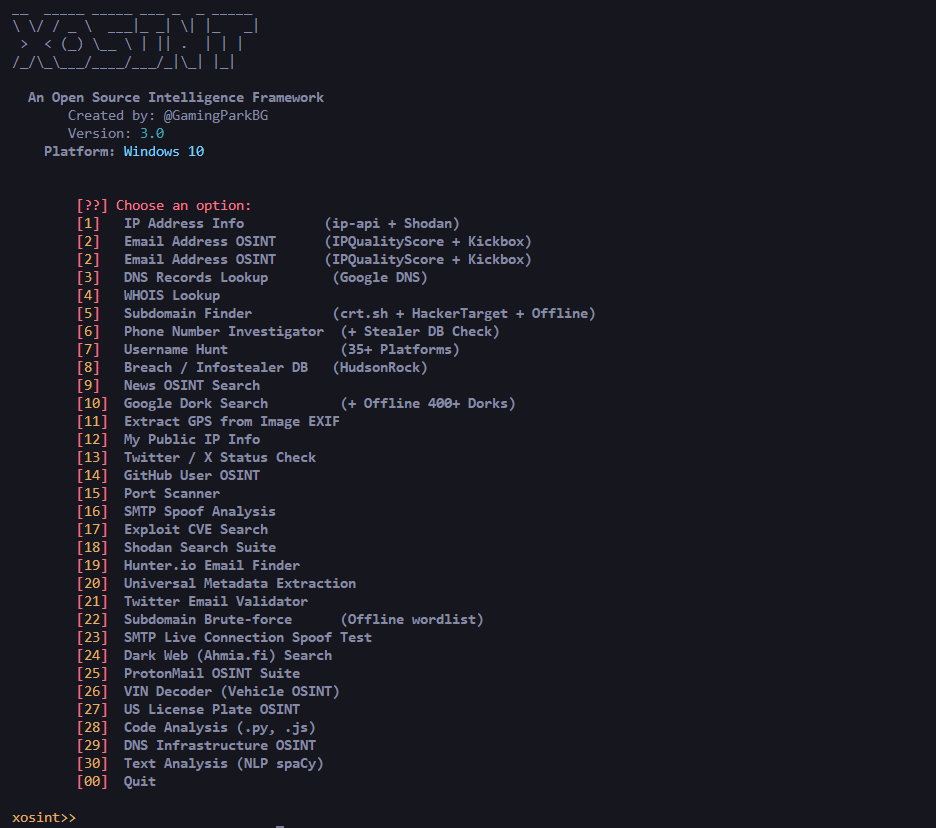

<div align="center">

```text
██╗  ██╗ ██████╗ ███████╗██╗███╗   ██╗████████╗
╚██╗██╔╝██╔═══██╗██╔════╝██║████╗  ██║╚══██╔══╝
 ╚███╔╝ ██║   ██║███████╗██║██╔██╗ ██║   ██║   
 ██╔██╗ ██║   ██║╚════██║██║██║╚██╗██║   ██║   
██╔╝ ██╗╚██████╔╝███████║██║██║ ╚████║   ██║   
╚═╝  ╚═╝ ╚═════╝ ╚══════╝╚═╝╚═╝  ╚═══╝   ╚═╝   
```

# XOSINT v3.0 — Advanced Intelligence Framework

**The ultimate open-source OSINT toolkit with Deep Web Dorking, Spiderfoot Engine, and System Integration.**


<br>

<br>

<br>

<br>

</div>

---

## 📌 What is XOSINT v3.0?

**XOSINT** has evolved into a full-scale **Hybrid Intelligence Framework**. It runs natively on **Windows, Linux, and Android (Termux)**. 

With v3.0, it utilizes the massive **Spiderfoot/WhatsMyName** engine to check over 700+ platforms concurrently in seconds. When executed on Android (Termux), it integrates deeply with the device system, requiring specific hardware permissions to unlock advanced forensic and network scanning modules.

> **Educational and Red Team purposes only. Use responsibly.**

---

## ✨ v3.0 Upgrades

- **Spiderfoot Engine Integration**: The Username Hunt (Option 7) now dynamically fetches the 700+ platform database from the WhatsMyName project and scans them concurrently via Fast Threading.
- **Advanced Automated Profiling**: Generates an intelligent, automated brief summarizing an entity's footprint, origins, and alternative handles dynamically.
- **30 Deep-Recon Modules**: 30 powerful modules including Dark Web searching, EXIF extraction, Shodan suites, CVE scanning, and more.
- **Cross-Platform Render Engine**: Completely rewritten terminal rendering engine to prevent encoding crashes on Windows PowerShell and legacy terminals.
- **Termux Deep System Integration**: Advanced hardware manipulation and network exploitation capabilities utilizing the native Android OS APIs.

---

## 🚀 Features (30 Modules)

| Module | Description |
|--------|-------------|
| 🌐 **IP / Domain Deep Lookup** | Geo, ISP, ASN, Open Ports, CVEs via Shodan |
| 🔍 **DNS Infrastructure** | A, AAAA, MX, NS, TXT, CNAME, SOA lookup |
| 👤 **Username Hunt (Spiderfoot)** | 700+ platforms checked concurrently + Deep Profiling |
| 🗂️ **Subdomain Finder** | crt.sh + HackerTarget + Offline enumeration |
| 📱 **Phone Investigator** | Global region mapping + Infostealer DB check |
| 📧 **Email OSINT** | Breach check, disposable, MX, Gravatar + Hunter.io |
| 🏴‍☠️ **Breach / Stealer DB** | Scans HudsonRock & dark databases for leaks |
| 🕷️ **Google Dorking** | Live DuckDuckGo scraping & Offline 400+ Dork list |
| 📍 **EXIF GPS Extractor** | Rip coordinates and metadata from images |
| 🛡️ **SMTP Spoof Analysis** | Check DMARC/SPF vulnerability of domains |
| 🚗 **VIN & US License Plate** | Vehicle intelligence decoding |
| 🤖 **Code & Text Analysis** | SpaCy NLP & Code syntax analysis |

---

#
## 📲 Installation (Termux)

### Step 0 — Download Termux (If you don't have it)
> ⚠️ **Important:** Do NOT download Termux from the Play Store (it's deprecated and broken).
> 
> Download the official working version here → [Termux (Direct Download)](https://github.com/termux/termux-app/releases/download/v0.118.0/termux-app_v0.118.0+github-debug_universal.apk) (Fast Github link)

### Step 1 — Update Termux packages
```bash
pkg update -y && pkg upgrade -y
```

### Step 2 — Install required packages
```bash
pkg install python termux-api -y
```

> ⚠️ **Important:** Also install **Termux:API** app from F-Droid (NOT Play Store).
> 
> Download here → [Termux:API (Direct Download)](https://github.com/termux/termux-api/releases/download/v0.50.1/termux-api_v0.50.1+github-debug.apk) (Fast Github link)


### Step 3 — Download xosint
```bash
# Clone the repo
git clone https://github.com/asrarkhann116-ops/X-osint
```

```bash
cd X-osint
```
### Step 3 — Install Python dependencies
```bash
pip install -r requirements.txt
```

### Step 4 — Run
```bash
bash install.sh
```
###  **or do**

```bash
bash setup.sh
```

###  USAGE FOR RUNNING ANYTIME
```bash
python xosint.py
```

###  **DONT FORGET TO GIVE ALL PERMISSION IT ASKS , OTHERWISE OSINTING WILL NOT WORK**
---

## ⚠️ First Run — Permissions

On the **first run**, xosint will request several Android permissions.  
These are needed for full functionality:

| Permission | Used For |
|------------|----------|
| Storage | Save temporary scan results |
| Location | Network-based location for geo modules |
| Camera | Future: QR code scanning module |
| Microphone | Future: Voice OSINT module |
| Contacts | Future: Contact cross-reference |
| SMS | Future: SMS-based verification checks |
| Call Log | Future: Number analysis module |

> ✅ **Allow all permissions** when prompted.  
> If you accidentally deny any, re-run `python xosint.py` and allow when asked again.

### Windows / Linux Installation
```bash
git clone https://github.com/asrarkhann116-ops/X-osint
cd X-osint
pip install requests colorama
```

---

## 💻 Usage

```bash
python xosint.py
```

The tool operates via a seamless CLI menu. Just enter the number of the module you wish to execute.

### Example: Username Hunt (Spiderfoot Engine)
```text
xosint>> 7
  Username: johndoe

[USERNAME HUNT & PROFILING] johndoe
  ----------------------------------------------------
  [!] Running Deep Web Dork for broad footprint (Alts/Mentions)...
  [DORK-HIT] https://www.instagram.com/johndoe/
  [~] Fetching Spiderfoot/WhatsMyName database (700+ sites)...
  [!] Scanning 719 platforms in parallel... (Fast Threading)
  [FOUND]  GitHub           >> https://github.com/johndoe
  [FOUND]  Reddit           >> https://reddit.com/user/johndoe
  [FOUND]  Patreon          >> https://www.patreon.com/johndoe
  Spiderfoot Scan: Added 14 additional platforms.
  ----------------------------------------------------
```

---

## 📦 Core Dependencies

- `python >= 3.8`
- `requests`
- `colorama`
- Optional Modules: `hunter_io_api.txt` (For Hunter.io Email OSINT)

---

## 🤝 Contributing

Pull requests welcome! For major changes, open an issue first.

## 📄 License

MIT License — free to use, modify, and distribute.

---

<div align="center">

**Made with ❤️ for the OSINT & Red Team community**

</div>
